<h1 align="center">Underprint</h1>

<p align="center"><strong>Invisible marks. Visible evidence.</strong></p>

<p align="center">
  A native Rust toolkit for durable image watermarking, exact detection, and portable provenance.
  One engine for Rust, the CLI, C, and PHP—without Python or a sidecar.
</p>

<p align="center">
  <a href="https://github.com/Schem-at/underprint/actions/workflows/ci.yml"></a>
  <a href="./LICENSE"></a>
  
  
</p>

<p align="center">
  
</p>

Underprint turns watermarking into a library contract rather than an infrastructure
arrangement. The first compatibility profile, `trustmark-q-bch5@1`, reads and
writes the same 61-bit TrustMark payload used by Schematio, using native ONNX
Runtime inference and pinned model identities.

Every embedding candidate is serialized to the final PNG and decoded again.
Underprint returns the first candidate that recovers the exact requested bits—or
fails closed.

## What works today

- Native TrustMark Q / BCH-5 embedding and detection on CPU
- Adaptive strength escalation: `0.6 → 0.7 → 0.8 → 0.9 → 1.0`
- Bounded PNG, JPEG, and still-WebP input with RGB PNG output
- Rust API and scriptable CLI with versioned JSON
- Stable C ABI with opaque validated handles
- Direct PHP FFI using contiguous binary buffers
- Lazy encoder and decoder sessions with explicit runtime policies
- Exact cross-runtime decoding with TrustMark 0.9.1 / PyTorch

The compatibility foundation is working and benchmarked. Underprint has not yet
completed the production corpus, fuzzing, multi-platform release, or external
security-audit gates tracked in the [roadmap](./TODO.md).

## Measured, not guessed

<p align="center">
  
</p>

The reference PHP FFI run used Apple Silicon and a public 240×240 fixture. The
default policy reduces steady resident memory from 442 MiB to 147 MiB. The
throughput policy reaches 35 ms detection and 201 ms embed plus exact
self-verification while still using less memory than the original implementation.

At 1024×1024, the bounded default was 36% faster for detection, 41% faster for
embed/self-verification, and 64% lower in steady memory than Schematio's Python
worker on the same fixture. See the complete [method and results](./benchmarks/results/apple-silicon-2026-08-19.md).

## Try it

Model weights are intentionally not committed or bundled. Fetching them records
and verifies the exact expected sizes and SHA-256 digests:

```bash
git clone https://github.com/Schem-at/underprint.git
cd underprint
./scripts/fetch-models.sh
cargo build --profile minimal-release -p underprint-cli -p underprint-ffi
```

Then inspect readiness, embed a token, and detect it again:

```bash
target/minimal-release/underprint doctor --models ./models

target/minimal-release/underprint embed input.jpg \
  --output protected.png \
  --payload 1011011110011000111111000000011111011111011100000110110110111 \
  --models ./models

target/minimal-release/underprint detect protected.png \
  --models ./models \
  --json
```

Detection exits `0` when present and `1` when absent. Invalid arguments, unsafe
input, unavailable algorithms, resource limits, and internal failures retain
distinct exit codes.

## Call it directly from PHP

The PHP adapter loads one reusable native context per process and transfers image
bytes directly—no base64, shell command, HTTP hop, or Python interpreter.

```php
use Underprint\Native;

$underprint = Native::load(
    modelsDirectory: __DIR__.'/models',
    libraryPath: getenv('UNDERPRINT_LIBRARY_PATH') ?: null,
);

$token = '1011011110011000111111000000011111011111011100000110110110111';
$embedded = $underprint->embed(file_get_contents('input.jpg'), $token);
file_put_contents('protected.png', $embedded->image);

$detection = $underprint->detect(file_get_contents('protected.png'));
```

The bounded-memory runtime is the default. Dedicated latency-sensitive workers
can opt into the measured throughput policy:

```php
$underprint = Native::load(__DIR__.'/models', runtimeConfiguration: [
    'intra_threads' => 6,
    'cpu_arena' => true,
    'memory_pattern' => false,
    'prepacking' => true,
]);
```

FFI is best suited to a bounded pool of persistent Laravel queue or Octane
workers. Loading neural models into every short-lived PHP-FPM process is usually
the wrong topology.

## Build profiles

```bash
# Fast normal development
cargo build --workspace

# Stripped compatibility artifacts with full LTO
cargo build --profile minimal-release -p underprint-cli -p underprint-ffi

# Verify everything the public CI checks locally
cargo fmt --all -- --check
cargo clippy --workspace --all-targets -- -D warnings
cargo test --workspace
./scripts/check-abi-sync.sh
./scripts/check-exports.sh target/minimal-release/libunderprint.dylib # .so on Linux
./scripts/test-c-abi.sh
```

The stripped reference artifacts are about 17 MiB each for the CLI and shared
library. The two separately acquired TrustMark Q models total about 62 MiB.

## Repository map

| Path | Purpose |
|---|---|
| `crates/underprint` | Limits, media policy, profiles, orchestration, and reports |
| `crates/underprint-trustmark` | Pinned TrustMark compatibility engine |
| `crates/underprint-ffi` | Stable C ABI used by PHP and other languages |
| `crates/underprint-cli` | Human and machine-readable command line |
| `bindings/php` | Direct PHP FFI adapter |
| `vendor/trustmark` | Attributed, modified Adobe TrustMark Rust source |
| `models` | Model manifest and separately downloaded artifacts |
| `docs/requirements.md` | Full multi-algorithm product requirements |
| `TODO.md` | Executable roadmap and production gates |

## Evidence, not overclaiming

A recovered watermark is a technical observation. It is not automatically proof
of authorship, ownership, consent, or authenticity. Underprint deliberately keeps
detection, future cryptographic evidence, provenance resolution, and application
policy as separate facts.

Likewise, Underprint owns its original orchestration, ABI, schemas, policies, and
integration code—not Adobe's TrustMark work or model weights. Source provenance
and redistribution boundaries are documented in [NOTICE](./NOTICE),
[THIRD_PARTY_LICENSES.md](./THIRD_PARTY_LICENSES.md), and the
[model manifest](./models/manifest.json).

## Figures

The architecture and performance infographics are editable
[Kineglyph](https://github.com/Nano112/kineglyph) scenes. Rebuild the committed
SVGs with:

```bash
npm ci
npm run render:figures
```

See Kineglyph's [Node and Bun guide](https://nano112.github.io/kineglyph/node-and-bun/)
for the same scene-to-SVG workflow.

## Licence

Original Underprint source is MIT licensed. Vendored dependencies and separately
acquired artifacts retain their own copyright, licence, and redistribution terms.
